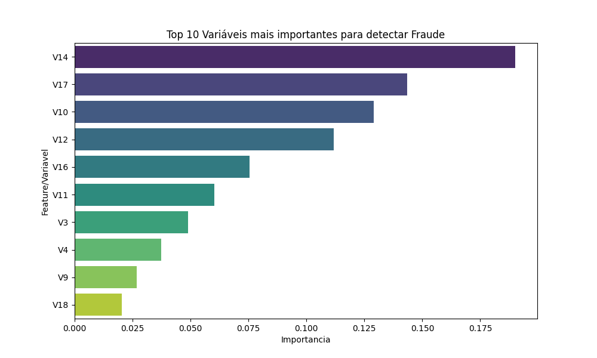
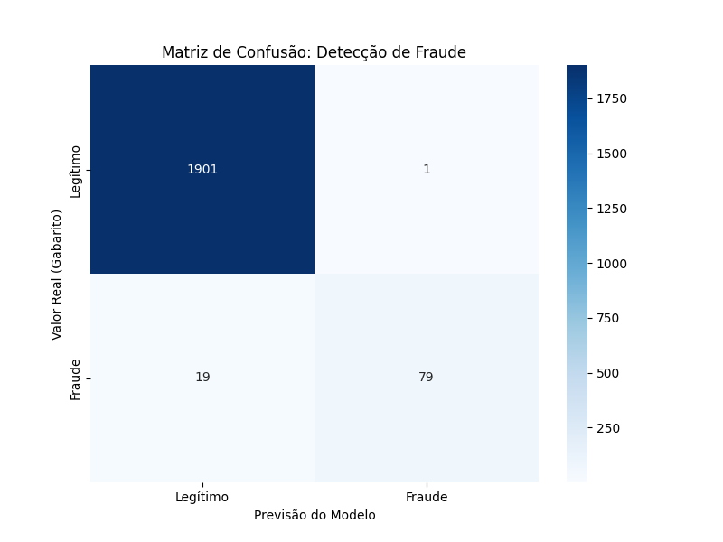

  

# 🛡️ Fraud Detection in Credit Cards | Detecção de Fraude em cartão de crédito
This project leverages Machine Learning to identify fraudulent transactions..  

 <small>*Este projeto usa Machine Learning para identificar transações fraudulentas.*</small>    

The main focus is balancing fraud detection with a seamless customer experience.. 

>  *O foco principal é equilibrar a detecção de fraude com uma boa experiência para o cliente*..  

The objective is to analyze transactions: amount, time, location and classify:

>  *Objetivo é analisar as transações: valor, hora, local e classificar:*

> **✅ Legitimate / Not Fraud** *| Legítimo*  

> **🚩 Fraudulent** *| Fraude*

**🚀 Insight:** the strategic reduction of the dataset revealed that variable **V14** is important for distinguishing the transaction type..  

> *🚀 Insight: A redução estratégica do dataset que revelou que a variável V14 é importante para distinguir o tipo de transação*..  

This enabled a lightweight, fast model with high recall, without compromising precision..  

> *Isso permitiu um modelo leve, rápido e com alto Recall, sem perda de precisão*..  

The source file was the creditcard.csv from Kaggle.

> *O arquivo base foi o creditcard.csv do Kaggle.*

---

### 🛠️ 1. Methodology and tools | Metodologia e Ferramentas

**Supervised Classification Model** *| Modelo Supervisionado de Classificação*..  
  I performed a comparative test betweem 2 algorithms Random Forest e Logistic Regression..  

> *Realizei um teste comparativo entre os 2 algoritmos Random Forest e Logistic Regression*..  

  The model **Random Forest** achieved the best performance..  

> *O modelo Random Forest teve o melhor desempenho*..  

* **Random Forest:** este  modelo mostra quais colunas foram mais importantes para decidir se a transaçao é fraude ou não.

> *Random Forest: this is model shows wich features  were the most  very important for deciding wheather a transaction was fraud or not.*

  * **Confusion Matrix:** essential for knowing whether the model makes more mistakes on "false positive"="blocking an honest customer" or a "false negative"= not a fraud detect. 

  > *Matriz de Confusão: Essencial para saber se o modelo está errando mais o "falso positivo"=bloquear um cliente honesto ou o "falso negativo" = não detectar a fraude.*

  * **Features/Gráfico de Importância:** Diz o **porquê**. Se a variável **V14** está no topo, sabemos que o comportamento dela é o maior **"dedo-duro"** da fraude. O modelo identifica quais colunas foram mais importantes para a decisão.
  * **Curva Precision-Recall:** O melhor gráfico para dados desbalanceados. Diz a estabilidade; se a linha cair muito rápido, o modelo é instável para casos raros.
  * **Visualização de uma Árvore:** O Random Forest cria várias árvores. Analisei a primeira/index 0 para entender a lógica e as perguntas que o modelo faz tipo "O valor da compra é > X?"  Se sim, vá para a esquerda...".
  * **BoxPlot:** Para visualização da variável importante..  
    
* **Logistic Regression:** Para entender a probabilidade base (0 a 1).

---

### 📈 2. Fluxo do Projeto

a. **Coleta:** download do dataset original no Kaggle creditcard.csv.
b. **Ajuste de Escala:** criei um scrippt para diminuir o tamanho do dataset original, com ele não foi possível fazer download no GitHub, nome = creditcard_reduzido10mil.csv..  
####    Observação: com isso tive o insight de fazer análise tanto no dataset original quanto neste reduzido e obtive resultados diferentes.
c. **Limpeza:** remover dados nulos e normalizar valores, exemplo: transformar R$1,00 e R$10.000,00 para uma escala entre 0 e 1.
d. **Divisão:** separar 80% dos dados para treino e 20% para modelo testar e ver se aprendeu.
e. **Treino:**  comando `fit` para treinar o modelo.

##### 🔬 Experimentos com Amostragem = Prova Técnica
Para chegar ao modelo ideal, testei o comportamento do algoritmo **Random Forest** em três cenários = 3 tamanhos de dataset:

* **Cenário 1 = dataset Original:** 284.807 registros (apenas 0,17% são fraudes). O desbalanceamento extremo mascara a realidade através da acurácia.
* **Cenário 2 = redução proporcional :** 10.000 registros, mantendo a proporção original que eram apenas **17 casos de fraudes**..  
  O modelo não teve dados suficientes para aprender o padrão.
* **Cenário 3 = redução estratégica Data Sampling :** 10.000 registros, mas mantendo todos os **492 casos de fraude** originais..  
  O usei Random Undersampling, reduzi os dados em 96%, mantendo todos os 492 casos de fraude. A proporção subiu para **4,92%**.

| Cenário | Descrição | Resultado |
| :--- | :--- | :--- |
| **1. Original** | 284.807 registros (0,17% fraude) | Acurácia enganosa; V17 parecia mais importante. |
| **2. Proporcional** | 10.000 registros (17 fraudes) | Dados insuficientes para o aprendizado. |
| **3. Estratégico** | 10.000 registros (**492 fraudes**) | **V14 revelada como indicador crítico.** Equilíbrio ideal. |

> **3º cenário** foi o único que permitiu ao modelo identificar a **V14** como variável de importância para identificar o tipo de transação e alcançando o equilíbrio ideal entre Recall e Precision detectada através da Macro Avg..  
> Os outros cenários tinham a V17 como variável de importância.

---

### 📊 3. Resultado das métricas ---------------------------------------

* **Precision /Precisão:** de todas as vezes que o modelo disse é "Fraude", ele acertou..  
   Portanto o modelo é confiável para evitar o **Falso Positivo** que é bloquear um caso que não e fraude (cliente honesto).
* **Recall /Revocação:** de todas as fraudes que realmente aconteceram o modelo conseguiu pegar 81%..  
   Portanto o modelo é conservador, deixa passar algumas fraude mas não interrompe o cliente honesto. 
   * **Observação:** o desafio é equilibrar o Recall com a Precision para não bloquear **Não freaud** clientes honesto.
* **F1-Score:** é a média harmônica entre a Precisão e o Recall. Como os dois estão altos, o F1 mostra que o modelo  é equilibrado..  
   Mas temos que olhar então para o Macro AVG, será decisivo.
* **Macro Avg:** ele está alto, tem 99%, significa que aprendeu e prova que o modelo é um sucesso.
* **Acurácia:** Aqui está o maior perigo do modelo, tem 100% de acurácia, mas ela sozinha não diz nada.

##### Entendendo a Matriz de Confusão Gráfico de calor (heatmap)
Ela divide os resultados em quatro quadrantes:
* ✅ **Verdadeiro Positivo :** = SUCESSO - Era fraude e o modelo acertou - Canto inferior direito.
* ✅ **Verdadeiro Negativo :** = SUCESSO - Era compra normal e o modelo liberou - Canto superior esquerdo.
* ❌ **Falso Positivo :** = ERRO - Era compra normal, mas o modelo bloqueou - Canto superior direito. 
* ❌ **Falso Negativo :** = ERRO - Era fraude, mas o modelo deixou passar - Canto inferior esquerdo.
###### Visualização dos Resultados
###### Visualização dos Resultados

---

### 🎯  Conclusão:
O modelo é um sucesso com um aprendizado equilibrado garantindo uma confiabilidade de 99% definido pela métrica Macro Avg..  
Insight : ele identificou a V14 como outra variável importante para distinguir o tipo de transação..  
No 3º arquivo  consegui um resultado técnico muito próximo ao do arquivo completo que era muito grande processando apenas 10 mil registros..  
* Cuidado, nem sempre a Acurácia de 100% define se o modelo e bom ou ruim, temos que também olhar para as outras métricas : precision, recall e macro avg.

---
##### Análise detalhada, resultados e conclusão
[Análise](docs/analise.md)
